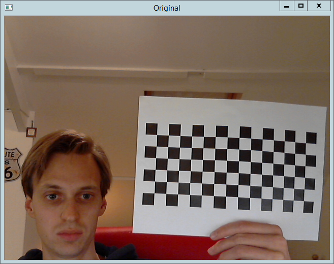
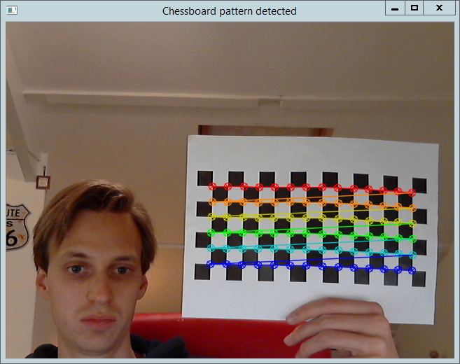
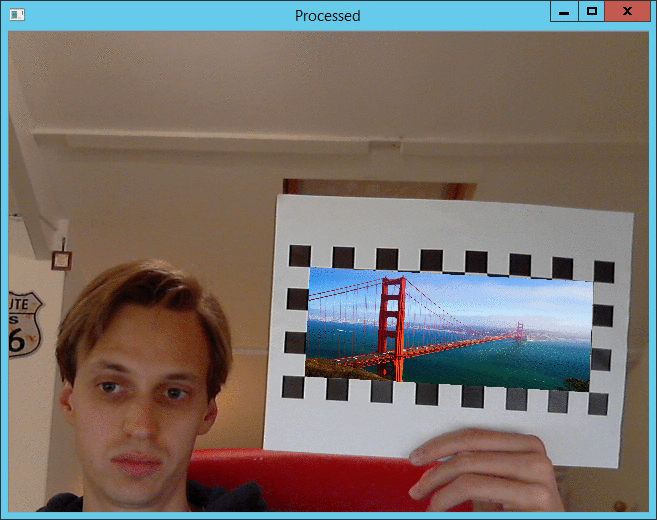

This is a simple and quick implementation of a augmented reality overlay. This C++ application uses OpenCV to insert an image on a chessboard that is shown in a video feed. The image will follow the chessboard no matter the angle or the rotation, as long as the chessboard is completely visible. Please note that moving the chessboard to fast will create a blur which makes it impossible to detect the chessboard. I hope to make this application better in the future!

Some examples:

*Original input frame*

*Chessboard drawing over the frame when chessboard is detected*

*The input image is put over the chessboard no matter the position*
